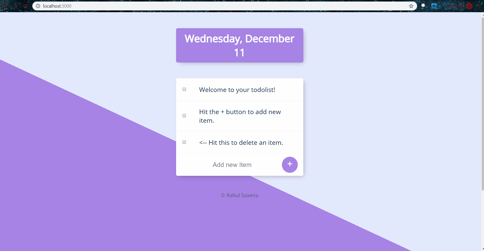

# To-Do-List
This is a To-Do-List web app. In this web app users can  
1. Create or visit a created new list by simply adding "/listName" to the url of web page
2. Add items to a list by typing new item and then clicking + sign 
3. Remove items from a list by clicking the checkbox to the left of item

## Preview

## Built With  
* [Express.js](https://expressjs.com/) - web application framework for Node.js
* [Mongoose](https://mongoosejs.com/) - ODM library for MongoDB database and Node.js
* [EJS](https://ejs.co/) - Embedded JavaScript templating for creating dynamic web pages.
* [body-parser](https://www.npmjs.com/package/body-parser) module
* [lodash](https://www.npmjs.com/package/lodash) module
* [HTML5](https://en.wikipedia.org/wiki/HTML5)
* [CSS](https://en.wikipedia.org/wiki/Cascading_Style_Sheets)
* [JavaScript](https://en.wikipedia.org/wiki/JavaScript)

## Author
* **Rahul Saxena**

